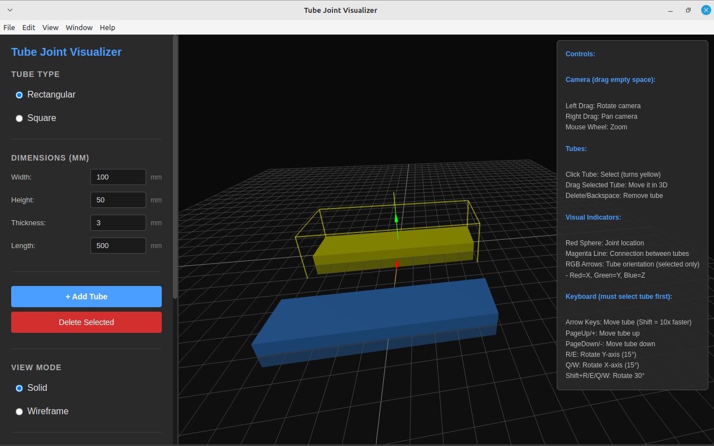
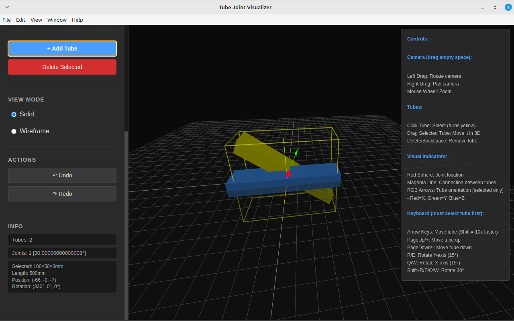
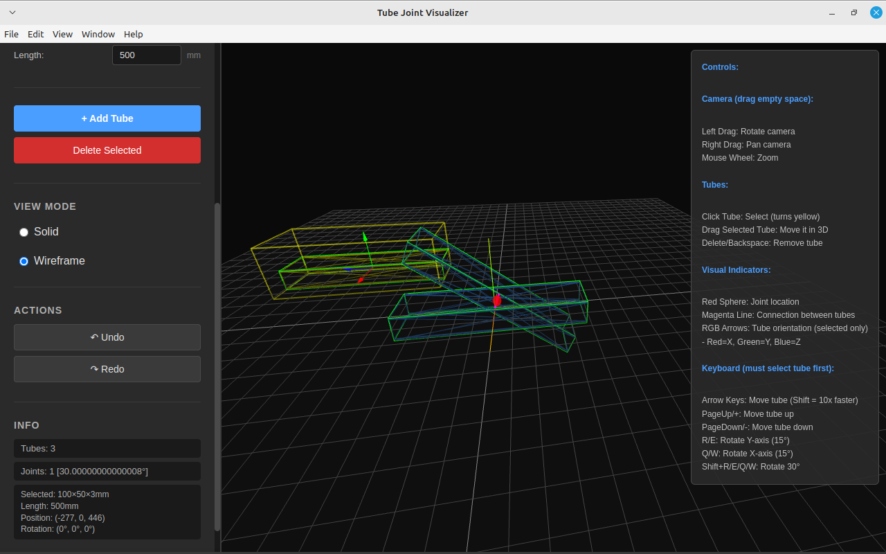

# 🔧 Tube Joint Visualizer

An interactive 3D desktop application for designing and visualizing rectangular/square tube joints with real-time angle detection and joint preview.


---

## 📋 Table of Contents

- [Features](#features)
- [Installation](#installation)
- [Usage](#usage)
- [Controls](#controls)
- [Building](#building)
- [Project Structure](#project-structure)
- [Requirements](#requirements)
- [License](#license)

---

## ✨ Features

### Core Functionality
- ✅ **Create Tubes** - Design rectangular and square hollow tubes with custom dimensions
- ✅ **Interactive Dragging** - Click and drag tubes in 3D space with mouse
- ✅ **Keyboard Movement** - Precise positioning with arrow keys (1 or 10 unit steps)
- ✅ **Tube Rotation** - Rotate tubes on X and Y axes with keyboard shortcuts
- ✅ **Visual Joint Detection** - Automatic detection when tubes get close (<100mm)
- ✅ **Joint Markers** - Red spheres and magenta lines highlight joint locations
- ✅ **Angle Display** - Real-time angle calculation (0°, 45°, 90°, 135°, 180°)
- ✅ **Multiple Tubes** - Build complex assemblies with multiple tubes
- ✅ **Selection Highlight** - Yellow color and bounding box for selected tubes
- ✅ **Undo/Redo** - Full history system (50 states)
- ✅ **View Modes** - Toggle between solid and wireframe display
- ✅ **Delete Tubes** - Remove selected tubes with Delete key

### User Interface
- 🎨 Professional dark theme
- 📊 Real-time info panel (tube count, joints, selected tube details)
- 🎮 Intuitive mouse and keyboard controls
- 📐 Dimension display with position and rotation
- 🔍 Zoom, pan, and rotate camera with OrbitControls

---

## 💻 Installation

### Prerequisites
- **Node.js** (v16 or higher)
- **npm** (comes with Node.js)

### Steps

1. **Clone the repository**
   ```bash
   git clone <repository-url>
   cd tube-joint-visualizer
   ```

2. **Install dependencies**
   ```bash
   npm install
   ```

3. **Run the application**
   ```bash
   npm start
   ```

---

## 🚀 Usage

### Creating Tubes

1. **Set dimensions** in the control panel:
   - Width (mm)
   - Height (mm)
   - Thickness (wall thickness in mm)
   - Length (mm)

2. **Click "Add Tube"** to create a new tube in the scene

3. **Select a tube** by clicking on it (turns yellow with bounding box)

4. **Move the tube** by:
   - **Dragging** with the mouse
   - **Arrow keys** for precise movement
   - **PageUp/PageDown** for vertical movement

5. **Rotate the tube** using keyboard shortcuts (see Controls below)

### Joint Detection

- When tubes are **within 100mm** of each other, joints are automatically detected
- **Red spheres** appear at joint midpoints
- **Magenta lines** connect the tubes
- **Joint angles** are displayed in the info panel (e.g., "Joints: 2 [90°, 45°]")

### View Controls

- **Toggle Wireframe** - Switch between solid and wireframe views
- **Orbit Controls** - Right-click drag to pan, left-click drag to rotate camera
- **Zoom** - Mouse wheel to zoom in/out

---

## 🎮 Controls

### Mouse Controls
| Action | Control |
|--------|---------|
| Select tube | Left-click on tube |
| Drag tube | Left-click + drag selected tube |
| Rotate camera | Left-click + drag on empty space |
| Pan camera | Right-click + drag |
| Zoom | Mouse wheel scroll |

### Keyboard Controls
| Key | Action |
|-----|--------|
| **↑** Arrow Up | Move tube backward (1 unit) |
| **↓** Arrow Down | Move tube forward (1 unit) |
| **←** Arrow Left | Move tube left (1 unit) |
| **→** Arrow Right | Move tube right (1 unit) |
| **Shift + Arrows** | Move tube 10 units (fast movement) |
| **PageUp / +** | Move tube up vertically |
| **PageDown / -** | Move tube down vertically |
| **R** | Rotate tube on Y-axis +15° |
| **E** | Rotate tube on Y-axis -15° |
| **Q** | Rotate tube on X-axis +15° |
| **W** | Rotate tube on X-axis -15° |
| **Shift + R/E/Q/W** | Rotate 30° (double speed) |
| **Delete / Backspace** | Delete selected tube |

### UI Controls
- **Add Tube** - Create a new tube with current dimensions
- **Delete Tube** - Remove the selected tube (or use Delete/Backspace key)
- **Toggle Wireframe** - Switch between solid and wireframe mode
- **Undo / Redo** - Navigate through edit history (buttons only)

---

## 🔨 Building

### Build for All Platforms
```bash
npm run build
```

### Build for Specific Platform
```bash
# Windows
npm run build:win

# macOS
npm run build:mac

# Linux
npm run build:linux
```

### Output
Built executables will be in the `dist/` directory:
- **Windows**: `.exe` installer
- **macOS**: `.dmg` disk image
- **Linux**: `.AppImage`

---

## 📁 Project Structure

```
tube-joint-visualizer/
├── src/
│   ├── main.js              # Electron main process
│   └── renderer/
│       ├── app-main.js      # Core application logic (Three.js)
│       ├── app-loader.js    # App initialization loader
│       ├── index.html       # Main HTML interface
│       └── styles.css       # Application styles
├── assets/                  # Application assets (icons, images)
├── dist/                    # Built executables (after build)
├── docs/                    # Documentation files
├── node_modules/            # Dependencies
├── package.json             # Project configuration
├── package-lock.json        # Dependency lock file
├── PROGRESS.md              # Development progress notes
├── LICENSE                  # License file
└── README.md               # This file
```

---

## 📦 Requirements

### System Requirements
- **OS**: Windows 10+, macOS 10.13+, or Linux (Ubuntu 18.04+)
- **RAM**: 4GB minimum (8GB recommended)
- **Graphics**: WebGL-compatible GPU

### Node.js Dependencies
- **Electron**: ^33.2.1 (Desktop framework)
- **Three.js**: ^0.181.1 (3D graphics library)
- **electron-builder**: ^25.1.8 (Build tool)

---

## 📖 Technical Details

### Technologies Used
- **Electron**: Cross-platform desktop application framework
- **Three.js**: 3D graphics rendering engine
- **WebGL**: Hardware-accelerated graphics
- **JavaScript ES6+**: Modern JavaScript features

### Key Classes
- **TubeJointApp**: Main application controller
- **Tube**: Tube geometry and rendering
- **History**: Undo/redo state management
- **Joint Detection**: Proximity and angle calculation

### Joint Detection Algorithm
- Detects tubes within 100mm proximity
- Calculates angles using vector dot product
- Snaps to standard angles (0°, 45°, 90°, 135°, 180°)
- Visual markers (spheres + lines) for joint preview

---

## 🐛 Troubleshooting

### App won't start
```bash
# Clear node_modules and reinstall
rm -rf node_modules package-lock.json
npm install
npm start
```

### Build fails
```bash
# Make sure electron-builder is installed
npm install --save-dev electron-builder
npm run build
```

### Graphics issues
- Update your graphics drivers
- Ensure WebGL is enabled in your browser/Electron
- Check GPU compatibility with Three.js

---

## 📝 License

ISC License - See [LICENSE](LICENSE) file for details

---

## 👤 Author

Developed as part of a coding challenge project.

---

## 🙏 Acknowledgments

- **Three.js** community for excellent 3D library
- **Electron** team for desktop framework
- Coding challenge organizers

---

## 📸 Screenshots

*(Add screenshots here after taking them)*

### Main Interface


### Joint Detection


### Wireframe Mode


---

**Made with ❤️ using Electron and Three.js**
